# Pattern Simulations

You can test and configure the code-level design patterns with this implementation: retry, circuit-breaker, cache-aside, strangler fig, queue-based load leveling and competing consumers, and distributed tracing. The following paragraphs detail steps to test these code-level design patterns.

## Retry pattern

We built an app configuration setting that lets you simulate and test a transient failure from the Web API. The setting is called `Api:App:RetryDemo`. We've included this configuration in the deployable code. The `Api:App:RetryDemo` setting throws a 503 error when the end user sends an HTTP request to the web app API. `Api:App:RetryDemo` is an editable setting that determines how many back-to-back exceptions should be thrown. A value of 1 generates one error after returning one successful response. This is disabled by default.  Removing the setting, or changing the value to 0 will disable the feature.

Follow these steps to set up this test:

1. Create a new key-value in App Configuration.
    - Go to App Configuration in the Azure Portal
    - Select your app configuration resource
    - Navigate to the "Configuration explorer" by clicking the link in the left-hand blade under "Operations"
    - Click the "+ Create" button and choose "Key-value"
    - Enter the following data:

    |Name|Value|
    |-----|-----|
    |*Key*|Api:App:RetryDemo|
    |*Value*|1|

1. Restart the API web app App Service
    - Go to the API web app App Service
    - Navigate to the "Overview" blade
    - Click the "Restart" button at the top of the page.

  > It will take a few minutes for the App Service to restart. When it restarts, the application will use the `Api:App:RetryDemo` configuration. You need to restart the App Service any time you update a configuration value unless you're using the [sentinal key](https://learn.microsoft.com/azure/azure-app-configuration/enable-dynamic-configuration-aspnet-core) approach.

We recommend observing telemetry for this test. We've configured Application Insights to collect telemetry. When the value of `Api:App:RetryDemo` is 1, the first request to the application API generates a 503 error. But the retry pattern sends a second request that is successful and generates a 200 response. We recommend using the Application Insights Live Metrics features to view the HTTP responses in near real-time.

> App Insights can take up to a minute to aggregate the data it receives, and failed requests might not appear right away in the Failures view.

To see the Retry pattern in action you can click throughout the Relecloud website and should not see any impact to the user's ability to purchase a concert ticket. However, in App Insights you should see the 503 error happens for 50% of the requests sent to the Web API.

For more information, see:

- [Application Insights Live Metrics](/azure/azure-monitor/app/live-stream)
- [Visual Studio and Application Insights live telemetry](/azure/azure-monitor/app/visual-studio)

> We recommend you cleanup by deleting the `Api:App:RetryDemo` setting. And restart both web apps to resume from a known state.

## Circuit Breaker pattern

We built an app configuration setting that lets you simulate and test a failure from the Web API. The setting is called `Api:App:RetryDemo`. We've included this configuration in the deployable code. The `Api:App:RetryDemo` setting throws a 503 error when the end user sends an HTTP request to the web app API. `Api:App:RetryDemo` has an editable setting that determines the number of back-to-back errors between a successful request. A value of 5 generates five errors after returning one successful response. This is disabled by default.  Removing the setting, or changing the value to 0 will disable the feature.

Follow these steps to set up this test:

1. Create a new key-value in App Configuration.
    - Go to App Configuration in the Azure Portal
    - Select your app configuration resource
    - Navigate to the "Configuration explorer" by clicking the link in the left-hand blade under "Operations"
    - Click the "+ Create" button and choose "Key-value"
    - Enter the following data:

    |Name|Value|
    |-----|-----|
    |*Key*|Api:App:RetryDemo|
    |*Value*|5|

1. Restart the API web app App Service
    - Go to the API web app App Service
    - Navigate to the "Overview" blade
    - Click the "Restart" button at the top of the page.

  > It will take a few minutes for the App Service to restart. When it restarts, the application will use the `Api:App:RetryDemo` configuration. You need to restart the App Service any time you update a configuration value unless you're using the [sentinal key](https://learn.microsoft.com/azure/azure-app-configuration/enable-dynamic-configuration-aspnet-core) approach.

To see these recommendations in action you can click on the "Upcoming Concerts" page in the Relecloud web app. Since the Web API is returning an error for every request you will see that the front-end applied the Retry pattern up to three times to request the data for this page. If you reload the "Upcoming Concernts" page you can see that the Circuit Breaker has detected these errors and that the circuit is now open. When the circuit is open there are no new requests sent to the Web API web app for 30 seconds. This presents a fail-fast behavior to our users and also reduces the number of requests sent to the unhealthy Web API web app so it has more time to recover.

> Note that App Insights can take up to a minute to aggregate the data it receives, and failed requests might not appear right away in the Failures view.

For more information, see:

- [Application Insights Live Metrics](/azure/azure-monitor/app/live-stream)
- [Visual Studio and Application Insights live telemetry](/azure/azure-monitor/app/visual-studio)

> We recommend you cleanup by deleting the `Api:App:RetryDemo` setting. And restart both web apps to resume from a known state.

## Cache-Aside pattern

The Cache-Aside pattern enables us to reduce read queries to SQL server. It also provides a layer of redundancy that can keep parts of our application running in the event of issue with Azure SQL Database.

For more information, see [Cache-Aside pattern](https://learn.microsoft.com/azure/architecture/patterns/cache-aside).

We can observe this behavior in App Insights by testing two different pages. First, visit the "Upcoming Concerts" page and refresh the page a couple of times. The first time the page is loaded the web API app will send a request to SQL server, but the following requests will go to Azure Cache for Redis.

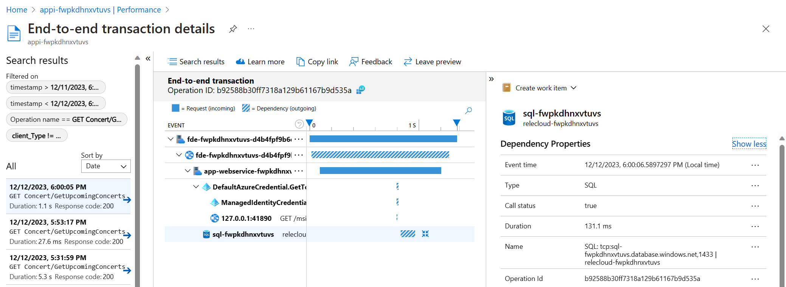

In this screenshot above we see a connection was made to SQL server and that retrieving the data took 131.1 ms.

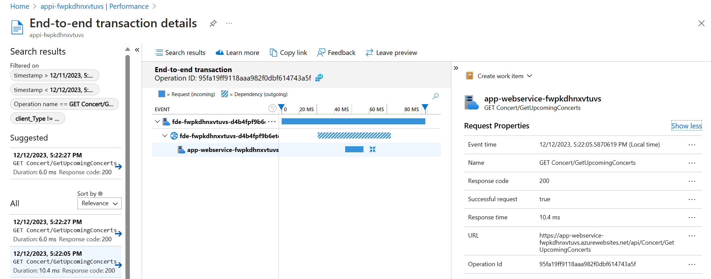

In the next request we see that the total duration of the API call was only 10.4 ms because it didn't have to connect to SQL Server and instead used the data from Azure Cache for Redis.

Using the (PREVIEW) Redis Console we can see this data stored in Redis.

Open the Redis Console by navigating to the Azure Cache for Redis resource in the Azure Portal and clicking the "Console" link above the overview details for this resource.

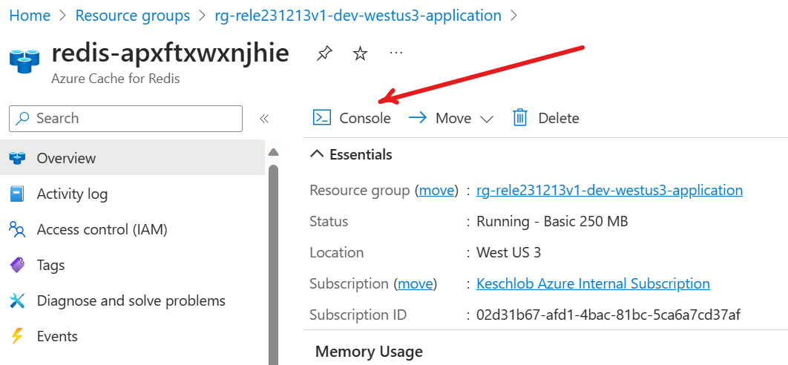


Run the following command to see all cached keys:

```
SCAN 0 COUNT 1000 MATCH *
```

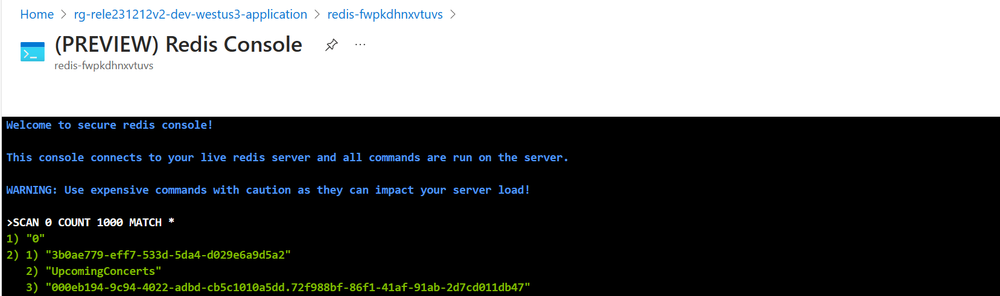

Run the next command to see the concert data cached from the database:

```
HGETALL UpcomingConcerts
```

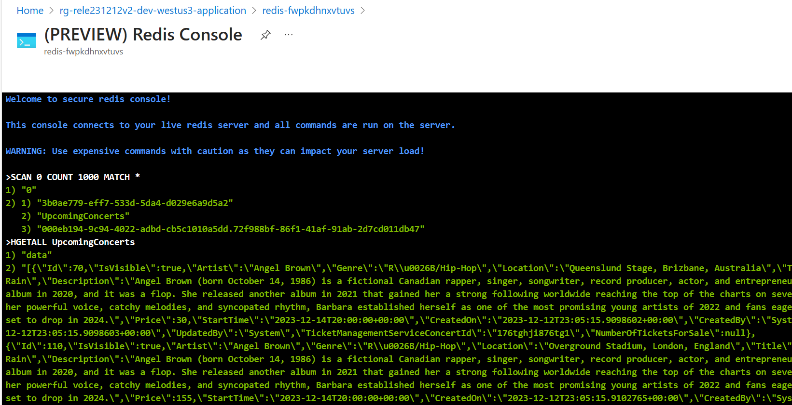

> You can use the command `DEL UpcomingConcerts` to delete this data from Redis and see the cache rebuild.

## Strangler Fig pattern

The strangler fig pattern is used to separate some functionality that was previously part of the Relecloud web API into a separate independently versionable and scalable service. Ticket rendering functionality is separated into a new service called the Ticket Rendering Service. We used an Azure App Configuration feature flag called `DistributedTicketRendering` that allows us to toggle between the old and new architectures (before and after applying the strangler fig pattern) for demo purposes.

By default, the new ticket rendering service is used. To switch back and forth, follow these steps:

1. Disable the `DistributedTicketRendering` feature flag.
    1. Go to App Configuration in the Azure Portal.
    1. Choose the 'Feature manager' option in the left-hand blade under 'Operations'.
    1. Note the feature flag named `DistributedTicketRendering` which should be enabled by default and click it to disable it, as shown in this screenshot.
        1. 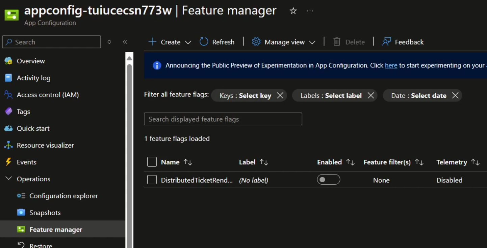
    1. Wait for 30 seconds. The change will take effect without needing to restart or redeploy the web app but it takes about 30 seconds to propagate.
1. Test purchasing a ticket.
    1. Navigate to the Relecloud web app and purchase a ticket. You will notice that the ticket image is available immediately because it is rendered as part of the purchase operation. If you purchase many tickets at once, though (try using the browser developer tools to set quantity to 400), you will notice that the purchase operation takes longer because the ticket rendering is done synchronously.
    1. Go to the Azure Service Bus resource in the Azure Portal and notice in the metrics on the Overview blade that no messages have been received. The screenshot below shows the metrics for the Service Bus resource as seen on the Service Bus overview blade.
        1. 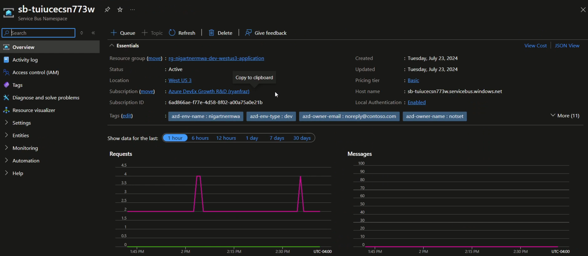
1. Enable the `DistributedTicketRendering` feature flag.
    1. Reverse the first step by going to the Azure App Configuration and enabling the `DistributedTicketRendering` feature flag.
    1. Again, wait 30 seconds for changes to propagate.
1. Test purchasing a ticket.
    1. Navigate to the web app and purchase a ticket. This time, the ticket image might not be immediately available, especially if you purchased many tickets. Purchasing many tickets should not block showing the purchase confirmation screen, though, since ticket rendering is done asynchronously by a separate service now. If you check back after a short while (a few seconds), you will notice that the ticket images are available.
    1. Go to the Azure Service Bus resource and notice that messages have been received. This is because ticket rendering is now performed in a separate service from the web API and communication is done via Azure Service Bus.
1. Finally, open the Relecloud solution and notice the new project called `Relecloud.TicketRenderer`. This is the new service that has been split from the original Relecloud web API according to the strangler fig pattern. This service can be maintained, versioned, deployed, and scaled independently from the original web API.

For more information, see [Strangler Fig pattern](https://learn.microsoft.com/azure/architecture/patterns/strangler-fig).

## Queue-based Load Leveling, Automatic Horizontal Scaling, and Competing Consumers patterns

The queue-based load leveling pattern is used to prevent the web API from being overwhelmed by a sudden spike in requests. As requests come in, they are added to a queue and processed by a ticket renderer worker service. This allows the queue to act as a buffer so the web API remains responsive even under heavy load and ticket rendering can be performed asynchronously.

The ticket rendering service, in turn, uses an automatic horizontal scaling pattern to add more replicas based on queue length so there are more instances deployed when much work needs done and there are few or none deployed when there is little or no work. This optimizes cost while still providing a responsive service. The ticket rendering service is implemented to be stateless and allow multiple instances to work on the same queue simultaneously. This means that the competing consumers pattern can be used to process work from the request queue in parallel when the service is scaled out to multiple instances, thereby increasing throughput.

To see these patterns in action, follow these steps:

1. Navigate to the Azure Container Apps resource in the Azure Portal and select the "Revisions and replicas" blade under the "Application" section in the menu on the left.
1. Notice the replica count, probably 1 or 0 unless you've recently rendered a lot of tickets, as shown in the image below. You can click the 'Show replicas' link to see the list of current replicas.
    1. 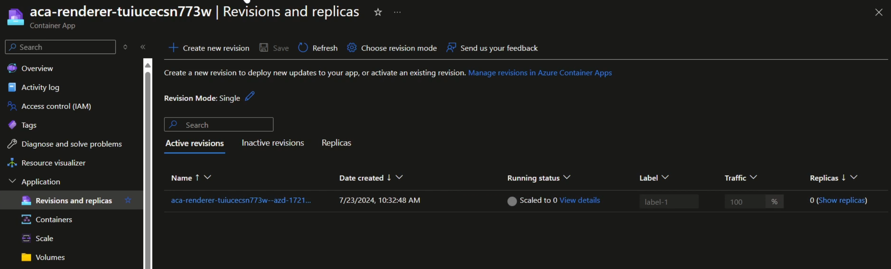
1. Now, navigate to the Relecloud web app and purchase multiple tickets. You can use the browser developer tools to set the quantity to 400, for example. Notice that although you are shown the purchase confirmation page, the ticket images are not available immediately. According to the queue based load leveling pattern, the ticket rendering is done asynchronously so the web API is not blocked.
1. After purchasing the tickets, navigate back to the Azure Container Apps resource and notice that the replica count has increased. This is because the ticket rendering service has automatically scaled out to handle the increased load based on the ticket rendering Service Bus queue length. These replicas will all work in parallel to process the tickets as quickly as possible.
    1. 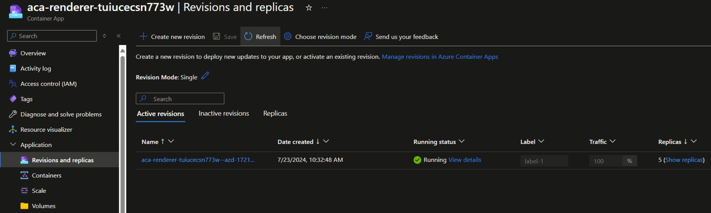
1. After some time (about five minutes), you will notice that the number of replicas has decreased again. This is because the ticket rendering service has scaled in to save costs since the queue length has decreased.

For more information, see [Queue-based Load Leveling pattern](https://learn.microsoft.com/azure/architecture/patterns/queue-based-load-leveling) and [Competing Consumers pattern](https://learn.microsoft.com/azure/architecture/patterns/competing-consumers).

## Distributed Tracing pattern

Distributed tracing is a diagnostic technique used to correlate traces from a request as it flows through multiple services in an application. This allows developers to view an end-to-end trace of a user request, showing how long each part of the system took to process the request and associated diagnostics. When the application receives a request, it is associated with a trace identifier. That identifier is passed to other components (via HTTP request headers or Service Bus message properties, for example) when dependencies are invoked. Then, when traces and logs are emitted, they include both the trace identifier as well as an activity identifier (also known as a span identifier) corresponding to the specific component the trace comes from and the activity’s parent. In this way, it’s possible for monitoring tools to show trees of activities involved in serving a single logical request along with all logs and traces emitted while serving the request even if they came from different services.

We have implemented distributed tracing using [OpenTelemetry](https://learn.microsoft.com/dotnet/core/diagnostics/observability-with-otel) and Application Insights. Because the Azure SDK and ASP.NET Core SDK support distributed tracing out of the box, trace identifiers and activity identifiers are automatically propagated between services with only minimal configuration in the application services.

To see distributed tracing in action, follow these steps:

1. Navigate to the Relecloud web app and purchase a ticket. This will cause a request to be sent to the web front end. The front end will call the web API which will then send a message to the ticket rendering service via Azure Service Bus. There are also multiple database updates along the way.
1. Navigate to the Application Insights resource in the Azure Portal and select the "Transaction Search" blade. This will allow you to search recent traces.
1. Search for "rendering". You should see some recent traces related to rendering activities, as shown below.
    1. 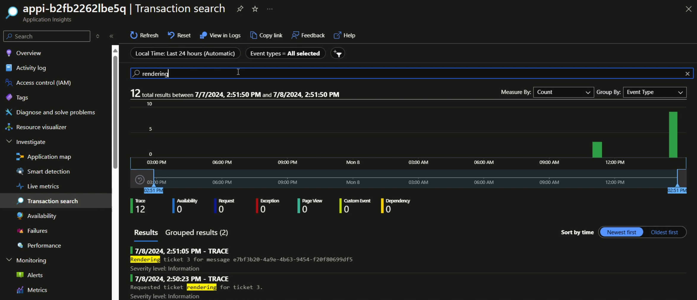
1. Click on one of the traces to see more details. You will see a list of correlated traces and events showing diagnostic information for the entire request across multiple services.
1. Click the 'View timeline' button to see a timeline tree of the activities involved in serving the request. This will show you how long each part of the system took to process the request and allows selecting any individual event to see more details.
    1. 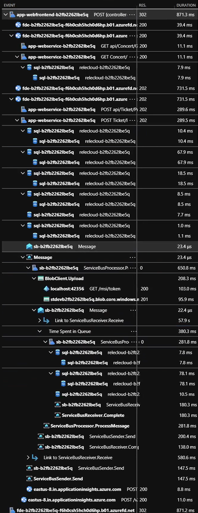

For more information, see [.NET Distributed Tracing](https://learn.microsoft.com/dotnet/core/diagnostics/distributed-tracing).
